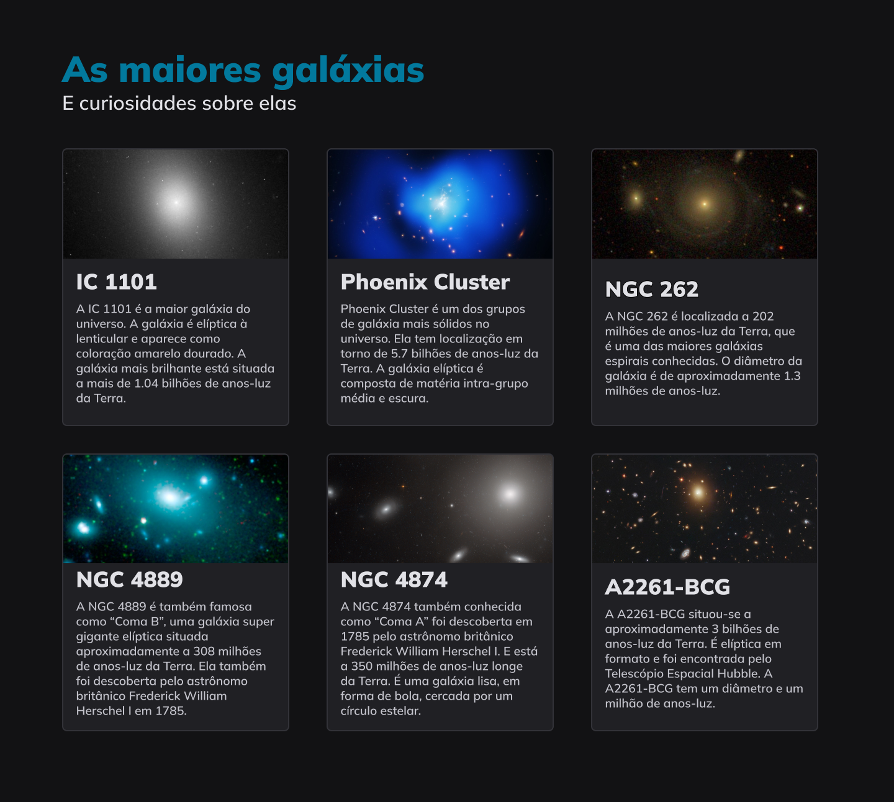

<h1 align="center">Galaxies</h1>

  <a href="#-tecnologias">Tecnologias</a>&nbsp;&nbsp;&nbsp;|&nbsp;&nbsp;&nbsp;
  <a href="#-projeto">Projeto</a>&nbsp;&nbsp;&nbsp;|&nbsp;&nbsp;&nbsp;
  <a href="#memo-licença">Licença</a>

  

## 🚀 Tecnologias

Esse projeto foi desenvolvido com as seguintes tecnologias:

- HTML e CSS
- Git e Github
- Figma

## 💻 Projeto

esse foi um projeto feito para praticar a e aprender mais sobre o grid.

- [Acesse o projeto finalizado, online](https://gustavo-bercacollo.github.io/galaxies/)

## :memo: Licença

Esse projeto está sob a licença MIT.
